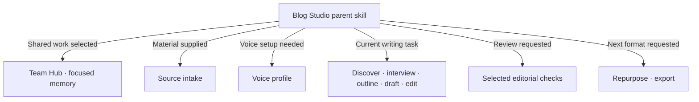

# Blog Studio

**A writing partner inside your own Codex or Claude harness.**

Bring a rough idea, a stack of notes, or a blog you've already written. Blog Studio helps you find the next useful step, uses your voice, and loads the writing guidance that step needs.

**6 starting paths · 14 capability modules · Reusable voices · Shared Team Hub · Resumable work**

[Get started](#get-started) · [Progressive disclosure](#how-progressive-disclosure-works) · [Roadmap and token estimates](docs/progressive-disclosure-roadmap.md) · [Install Blog Studio](docs/installation.md) · [Team Hub](docs/team-hub.md) · [Google Docs next](docs/google-docs-roadmap.md)

## Install once. Keep getting better.

Download the private [guided installer](dist/blog-studio-installer.zip), expand it, and open **Install Blog Studio.command** inside its `installer` folder. Choose Codex, Claude Code, or both. Setup reuses Git and Python, checks your GitHub access, and offers browser sign-in when needed. Missing tools get vendor installation instructions. See the [five-step setup guide](docs/installation.md).

**Writing guidance stays maintained here.** A new task quietly checks approved `main` and pins a local snapshot. The model receives a tiny status and reads only the instructions it needs. Your marketing team gets routine instruction updates without reinstalling; ongoing articles retain their saved guidance revision. Executable helpers update separately through setup, with repair and rollback.

The author workspace holds drafts, voices, evidence, and history outside the installed skill. A selected Team Hub synchronizes that working content to its separate private repository. Git download progress stays out of the conversation.

## Start where you are

| What you have in mind | What Blog Studio helps you do |
|---|---|
| **Help with my draft** | Get feedback or a focused revision while preserving your original |
| **Write the first draft** | Turn a topic, audience, and angle into a coherent article |
| **Build an outline** | Develop the argument and section progression, then stop at the outline |
| **Write from my outline** | Expand your structure into a complete draft |
| **Interview me** | Draw out your experience through one focused question at a time |
| **Help me find an idea** | Explore your audience, interests, and the point worth making |

You can attach source content, paste notes, share links, reuse saved material, or start without it. Voice setup is available on its own: share authored writing, LinkedIn background, or a description of how you want to sound.

## How progressive disclosure works

The **parent skill** holds the brief, selected sources, voice, and requested outcome. It opens a capability when the current task needs it, then follows the relevant references within that capability.



| Stage | What appears in chat | Guidance loaded when needed |
|---|---|---|
| **Start** | The right starting choices, or immediate work on a clear request | Parent and entry flow |
| **Material** | Attachments, notes, links, or selected saved sources | Intake and source organization |
| **Voice** | Saved profile, learn my voice, requested tone, or preserve this draft | Voice setup and selected profile |
| **Write** | The next question, outline, draft, or revision | The current writing capability |
| **Review** | Specific findings and proposed changes | Requested voice, factual-support, structure, humanization, or GEO checks |
| **Finish** | The requested artifact and optional next step | Export or repurposing guidance |

These stages adapt to your request. A clear draft request can continue through an internal outline; outline-only stops at the outline. A quick edit gets a focused review. Existing context is reused instead of asking you to repeat setup.

**The workflow stays in chat.** The optional [newcomer prompt generator](preview/blog-studio.html) helps you choose a starting request to paste into your harness. It doesn't generate the article or store your writing.

## Token footprint

The parent now names required capability reads and conditional support reads explicitly. Parent plus entry flow is approximately **1,195 tokens**, down from 2,329 (49% less). See the [M1 validation record](docs/m1-entry-validation.md).

M2 now loads **450–498 tokens** for a routine continuity operation, including its small router. M3 supplies concise writing, editing, strategy, and title guides; the original sources remain optional. See the [combined validation record](docs/m2-m3-validation.md).

Progressive disclosure keeps the full reference library available while selecting guidance for the current operation. The library contains approximately **170.6k estimated tokens**; a normal route reads a subset. The total grows slightly because it includes both the retained originals and the new working guides.

| Route | Current managed guidance | Offline target after roadmap |
|---|---:|---:|
| Outline with sources | 4.4k | 2–3k |
| First draft with sources | 6.0k | 3–5k |
| Quick edit | 5.4k | 2.5–4k |
| Voice setup | 4.8k | 2–3.5k |
| Comprehensive review | 7.5k | 4–6k |

The installed bootstrap is approximately **857 tokens**. Current route figures include it plus the selected repository guidance; offline targets and the full library total exclude the bootstrap. Downloading that library does not load it into context.

Estimates use characters ÷ 4 and count each selected instruction file once. They include workspace guidance and exclude author material, generated prose, conversation history, and host/tool context. They are planning estimates rather than total billed usage. Targets are **planned refinements**, and already loaded text can remain in the conversation.

See the [full roadmap](docs/progressive-disclosure-roadmap.md) for file-level estimates, assumptions, source/output allowances, and acceptance criteria.

## Work that carries forward

- **Your voice:** reusable profiles, auditions, explicit preferences, and a pinned revision for each article.
- **Your sources:** original files, readable text, provenance, and separate roles for evidence, inspiration, background, and authored samples.
- **Your manuscript:** an untouched original, saved outlines and drafts, version history, and a checkpoint for resuming.
- **Your reviews:** findings tied to the draft, voice, and evidence they checked, with clear current, stale, failed, unavailable, or not-run status.

The local `.blog-studio/` projection is excluded from the skill repository. Select a **Team Hub** to synchronize working content through a separate private repo; a workspace without a selected hub remains local.

## Shared memory for your team

> Create our Team Hub at my-org/marketing-writing.

> Join our Team Hub at https://github.com/my-org/marketing-writing.

> Find our onboarding draft and help me continue. Remember this new rule for the launch project.

The administrator creates a private remote and local clone. Members with existing access join through chat. Blogs, notes, sources, voices, reviews, and user-defined rules/context share by default in the selected workspace. Offline saves queue locally; concurrent edits retain both versions; protected main uses a contribution PR.

Update to runtime **1.1.0** using the trusted installer. No actual team repo is created by downloading or installing the skill. See [Team Hub usage](docs/team-hub.md) for setup, sharing, and the current verification boundary.

## Your content and outside services

Private content stays in your existing harness and, when selected, your private
Team Hub. Borrowed research/media suggestions do not authorize sending drafts,
voice samples, notes, or team context to additional services. Public searches
use nonconfidential terms; requested document posting sends only the selected
content to its intended audience. No telemetry or hidden upload client is bundled.

Your harness/model provider and GitHub still process data under your account
settings. See the [data exposure review](docs/privacy-review.md) for the checked
surfaces, safeguards, and limits.

## Get started

**From this repository:** open it in your harness and ask:

> Use `skills/blog-studio/SKILL.md` to help me start a blog. Show me the relevant starting choices and source and voice options.

Or start with a concrete outcome:

> Use `skills/blog-studio/SKILL.md` to build an outline from my attached notes. Keep it conversational and stop at the outline.

**For a completely offline/manual installation:** expand [blog-studio.zip](dist/blog-studio.zip) and copy the complete `blog-studio` folder into your harness's skill directory. Keep its references and helpers together. See [setup and package details](PACKAGE.md) for locations and local usage.

**For the newcomer prompt generator:** open [preview/blog-studio.html](preview/blog-studio.html) locally, or serve it with:

```sh
python3 -m http.server 8896 --bind 127.0.0.1 --directory preview
```

Then visit `http://127.0.0.1:8896/blog-studio.html`.

## What's implemented and what's next

The six routes, fourteen capability modules, local continuity helpers, and portable packages are implemented. **87 deterministic tests cover local helpers, Team Hub, privacy boundaries, guidance refresh, and managed installation**, alongside package integrity and extracted-bundle portability checks. The Mac launcher and installer are implemented; a clean-machine sign-in pilot and actual discovery/writing in both harnesses remain validation gaps.

| Next milestone | Estimated development tokens |
|---|---:|
| Scope review and evidence reads | 10–18k |
| Complete route/discovery and clean-machine newcomer pilots | 12–22k |
| Google Docs intake, review handoff, and return (first slice) | 15–25k |

The repository bootstrap and M1–M3 guidance refinements are delivered. M4 will further scope review/evidence reads; M5 validates the full conversational experience. Development ranges are planning estimates, with overlapping pilot work excluded from additive totals. See the [progressive roadmap](docs/progressive-disclosure-roadmap.md) and [Google Docs roadmap](docs/google-docs-roadmap.md).

## Verify and package

```sh
python3 -m unittest discover -s tests -v
python3 skills/blog-studio/scripts/validate_package.py
python3 scripts/measure_guidance.py --check
python3 scripts/package_blog_studio.py
python3 scripts/package_installer.py
```

Portable ZIPs and checksums are in [dist](dist/). The original five-skill collection remains available as [blog-writing-toolkit](skills/blog-writing-toolkit/SKILL.md).

Upstream sources retain their licenses and pinned provenance. See [package notes](skills/blog-studio/references/package-notes.md), [source lock](skills/blog-studio/sources.lock.json), and [BlogForge asset lock](skills/blog-studio/blogforge.lock.json).
