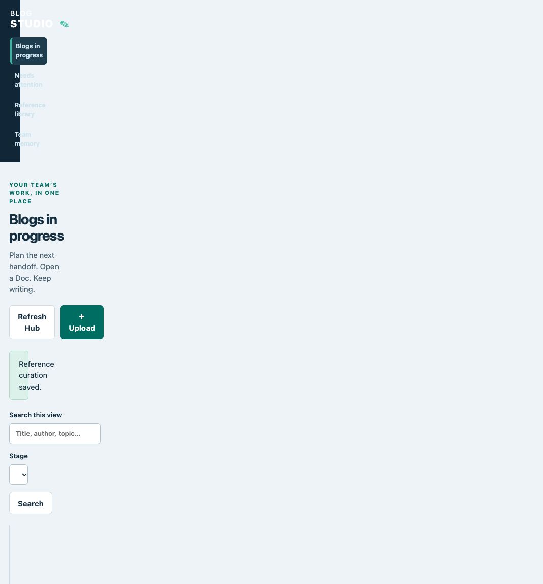

# Your editorial desk



*Sample content; your desk shows your selected workspace and Team Hub.*

In Codex or Claude Code, say **“Use Blog Studio. Open editorial desk.”**
The page opens on your computer against your current writing workspace and
selected Team Hub. Keep the helper running while you use the page.

## What you can do

**Blogs in progress** shows titles, authors, owners, due dates, editorial stages,
and saved working Google Doc links. Open a local blog to assign an owner, choose a
due date, or record a stage. Choose **Resume** on a shared blog to bring its saved
revision into your workspace. Existing unshared edits are protected.

**Needs attention** collects saved review findings, stale checks/companions,
waiting questions and sharing problems. Ask in chat to refresh Google feedback
for your selected blog. Viewing an inbox does not apply or accept an edit.

**Reference library** lets you search saved sources, read a bounded excerpt, add
topic/product tags, and mark a reference active, pending, or retired. Retirement
keeps earlier Git versions. Dated product claims need current verification.

**Upload** accepts Markdown, text, HTML, DOCX and PDF. Originals remain saved.
PDFs need text extraction in chat. Check **Start an editable blog** only when you
want a manuscript; an ordinary reference upload does not start a new blog.

**Team memory** lets you read and save notes, context and writing rules. Choose
whether a memory applies to the team, a project, an author, or one blog. Changes
create revisions; existing blogs keep their selected context until deliberately
updated. Collection settings and candidate lessons use their focused chat flows.

## Bring in your earlier blogs

Say **“Import our old blogs from [folder, feed, website, or export].”** Blog Studio
asks for a collection name and any missing scope details, then previews posts,
exclusions and limits before importing. A refresh uses the same preview-and-batch
approach. It preserves originals, metadata and earlier versions, and reports
partial failures. Missing or unreadable posts are not counted as read or deleted.

Use **“Find our previous blogs about [topic]”**, then **“Use these as references.”**
Only selected passages enter the writing conversation. **“Learn from our old
blogs”** produces candidate observations and recommendations with supporting
passages; a candidate becomes a shared writing rule only by explicit choice.

## Work in chat, browse in the desk

Say **“Show evidence”** to inspect support for important claims, **“This needs a
diagram”** for a visual companion, or **“Package this for launch”** to prepare
selected channel copy. Companions record their input draft and sources and become
stale when those inputs change. Preparing them does not publish anything.

## Access and sharing

There is one contributor level. Everyone with existing Hub write access can use
the editing controls; GitHub repository admins manage membership. The desk checks
current GitHub access for shared edits. If access cannot be verified, check your
sign-in and repository permissions; ordinary chat saves still retain local work.

**Refresh Hub** checks shared Git changes. It does not refresh Google Docs.
Google links are saved working links, not proof the document is current. Use
**“Pull from Google Docs”** or request a live feedback refresh in chat.

The desk runs on your computer, not as a shared website. The private Hub's
homepage links generated **Editorial board** and **Reference collections** pages
when those features are used and synced. Work waiting for a contribution review
has not reached main. Ordinary GitHub Pages would make the content public;
private Pages requires an organization with GitHub Enterprise Cloud. This release
does not deploy Pages or introduce another account.

## Developer / support launch

The harness uses the installed interpreter and runtime:

```sh
python3 /path/to/runtime/studio.py --root /path/to/writing/.blog-studio manage
```

Open the exact returned local session URL. The process stays running until
Ctrl+C. The session URL is for your local browser; do not share it as a team link.

Save feedback distinguishes local retention, shared work and contribution review. A persistent sharing panel lists retained operations that still need attention. Use **Retry sync** for that checkpoint; it does not repeat an upload or memory edit. Errors stay in the open dialog so you can correct or reload without losing your entry.

## When a reference changes while you edit

Blog Studio keeps your proposed tags and notes and stops the save. Choose
**Reload and compare** to see the latest saved values beside your proposal. Then
choose **Use latest saved values** or **Keep my proposal for resubmission**, review
the form, and choose **Save curation**. Reloading alone does not write anything.
If the reference has unshared local edits, compare them in your chat first.

Changing views, searches or pages cancels older list requests. The loading message
marks the pending view; page buttons are disabled until it finishes. If loading
fails, the previous valid results remain visible.
