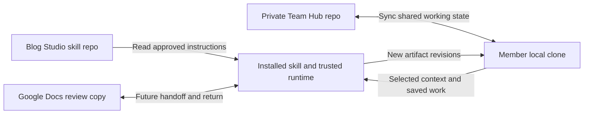

# Team Hub: shared working memory

Status: runtime and guidance implemented locally; deterministic verification and real-provider pilot status below. The team’s read/write work is shared by default. The Blog Studio skill and executable helpers remain in their separate repository.

A **Team Hub** is a private Git repository with a local clone on each member’s computer. It holds blogs, outlines, notes, interviews, sources, voices, reviews, decisions, and user-defined rules/context. Git provides durable history and synchronization; the skill provides a friendly way to create, join, read, and update it.

## What people say

| Request | What the skill does |
| --- | --- |
| “Create our Team Hub” | Ask for the GitHub owner/name and local destination; prepare the initial structure; create the private remote and local clone; verify it; select it as the active hub. |
| “Join this Team Hub: <repo URL>” | Check existing account access; clone or reuse the local hub; validate its schema; register it; show whether contributing is available. Joining assumes existing membership; it does not invite people or change account access. |
| “Use our team context to start a blog” | Quietly refresh the hub, select relevant rules, voices, notes, and evidence, then follow the normal blog workflow. |
| “Save this draft” | Save a new shared article revision and sync it at a meaningful checkpoint. Local work remains available if syncing fails. |
| “Remember this for the team” | Save the chosen note, decision, rule, or reusable context with its scope and provenance. |
| “What changed since I last worked on this?” | Compare the saved baseline with the latest shared revisions and show relevant changes. |

After selecting the hub, routine writing artifacts are shared working state. Explicit “save” requests and the agreed checkpoint policy authorize those bounded hub writes; the system does not ask for every Git commit. Existing local work is migrated only when selected, rather than sweeping a computer for content.

## Two repositories, one writing workflow

| Skill repository | Team Hub repository | Local-only system state |
| --- | --- | --- |
| Entry instructions, capability guidance, templates, installed runtime releases | Blogs and versions, notes, sources and selected originals, voices, reviews, scoped rules/context, Google Doc references | Credentials, machine paths, clone registry, task caches, locks, generated search index, offline write queue |

Local-only system state is bookkeeping; it does not make drafts private. The selected hub is the shared source for working artifacts. A member’s local clone is a working replica, including offline changes awaiting synchronization.

## How memory stays useful

The assistant looks up relevant memory rather than loading the whole repository into chat. A small local catalog supplies titles, kinds, scopes, tags, provenance, revision/status, and file paths. The skill reads the selected bodies or source passages only when needed. A large blog archive does not become permanent model context.

Rules/context are first-class records. They can apply to the team, a project, an author, or an article. Explicit current requests take precedence over applicable defaults; system and harness instructions remain authoritative. Rules can express tone, terminology, audience, formatting, citation preferences, and working conventions. They do not become executable code or silently expand account/publishing authority.

An article records the exact voice, source, context, and guidance revisions it used. New tasks can find fresh memory; active work retains its selected baseline until a requested refresh. Another member’s edits are surfaced before a conflicting save, not silently mixed into an in-progress draft.

## Concurrent work and failures

Store each change as a new immutable revision with a unique operation ID. People adding different records can sync without editing one shared index file. If two people revise the same draft or rule from the same baseline, retain both versions and ask the skill to reconcile the meaningful difference. No automatic “newest timestamp wins.”

A rejected push fetches the new remote state and retries the same operation against it. Retries are bounded; ambiguous network results are checked for that operation before another push. Offline work remains visibly queued. A protected branch uses a contribution branch/PR and reports “pending review,” not “shared with everyone.”

A hub reference to a Google Doc helps team members locate it; Google access remains controlled by Google. Git holds the article identity, transfer baseline, and requested snapshots, while the planned Google Docs workflow handles actual edits and return.

## Build order and planning estimates

| Slice | Outcome | Development tokens |
| --- | --- | ---: |
| H1 Hub format + create/join | Private repo lifecycle, managed local clone, active hub registry, schema validation | 12–20k |
| H2 Shared read/write + sync | Immutable revisions, queued saves, retries, semantic conflict handling, branch-policy outcomes | 18–30k |
| H3 Blog workflow + memory lookup | Shared articles/sources/voices/reviews, scoped rules, task pins, selected local-work migration | 18–28k |
| H4 Installer + team pilot | Runtime update, novice flows, multi-member and offline validation, docs | 10–17k |
| **Total initial design range** | | **58–95k** |

Runtime targets for added hub instructions: router/status 200–400 tokens; create/join 500–900; save/sync/conflicts 700–1,200; rules and memory selection 400–800. Selected memory content and existing writing/host instructions are additional. These are design targets, not measurements of an implemented feature.

The [detailed spec](superpowers/specs/2026-10-01-blog-studio-team-hub.md) and [implementation plan](superpowers/plans/2026-10-01-blog-studio-team-hub.md) define the interfaces, failure handling, and acceptance checks. No new hub repo, invitation, dependency install, or remote write was performed for this design.

## Implementation boundary

Local runtime/guidance implementation is complete. See [Team Hub usage](team-hub.md) for shipped behavior and verification. The real GitHub/member and harness pilot remains pending an explicit target; Google Docs provider operations remain separately planned.
